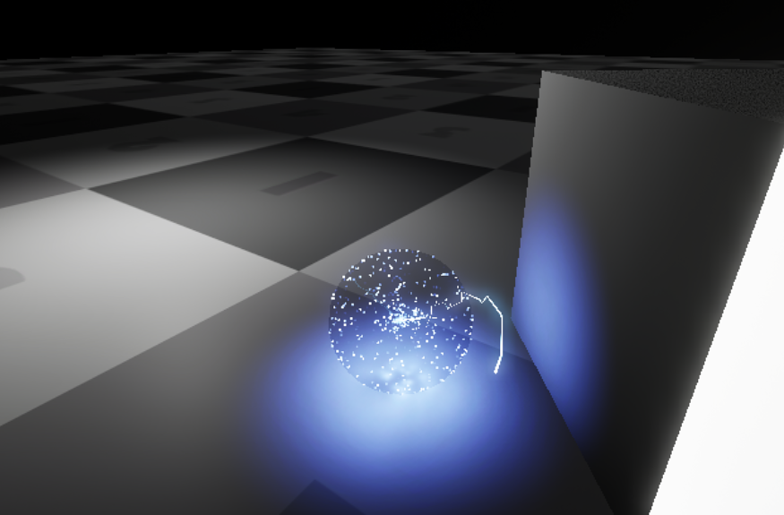

<h1 style="color: white; background: linear-gradient(43deg, #4158D0 0%, #d253c3 58%, #FB5959 100%); text-align: center; padding: 10px; box-shadow: 3px 3px 10px rgba(0,0,0,0.2); font-family: 'Segoe UI', Tahoma, Geneva, Verdana, sans-serif; border-radius: 5px; text-transform: capitalize;">
    Ion Cortex
</h1>

This is a puzzle solver powered by artificial intelligence.

*Created in Unreal Engine 5.3*

<h2 style="display: inline-block; padding: 5px 15px; border-radius: 5px; border-bottom: 3px solid #1a252f; font-family: 'Segoe UI', Tahoma, Geneva, Verdana, sans-serif; text-transform: capitalize; letter-spacing: 1.5px; box-shadow: 0px 3px 5px rgba(0,0,0,0.2);">
    Samples
</h2>

